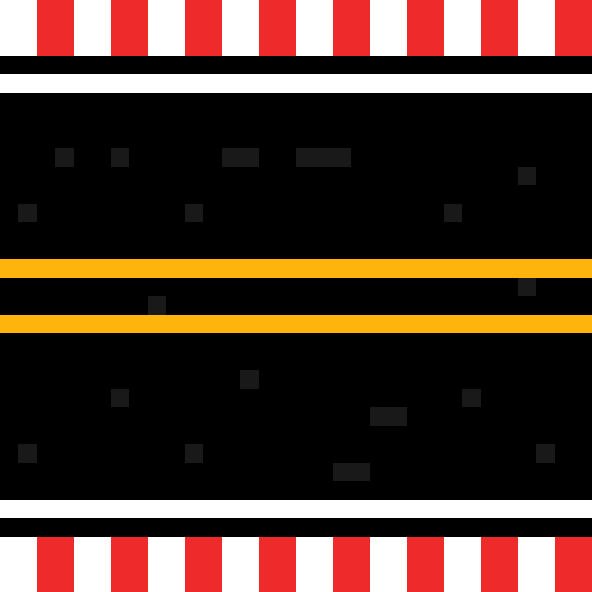
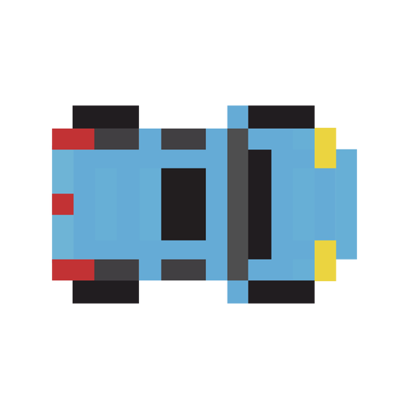
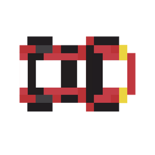

<html lang="en">
<head>
    <meta charset="UTF-8">
    <meta name="viewport" content="width=device-width, initial-scale=1.0">
    
    
</head>
<body>
    

        
        
        
    

    <button id="raceButton" onclick="startRace()">Start Race</button>
</body>
</html>