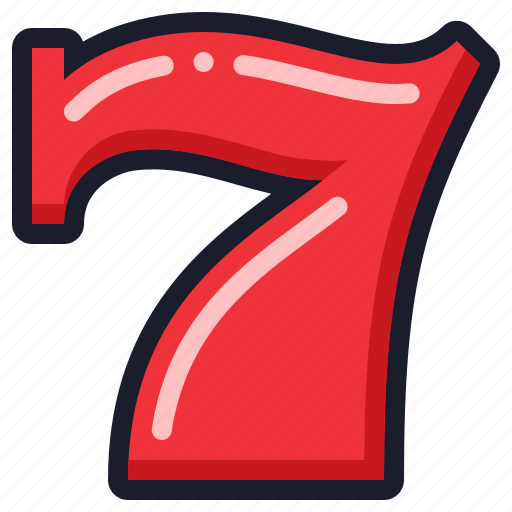
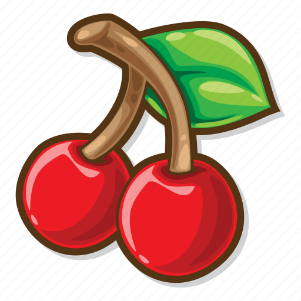

<html lang="en">
<head>
  <meta charset="UTF-8">
  <meta name="viewport" content="width=device-width, initial-scale=1.0">
  <title>Slot Machine</title>
  
</head>
<body>
  

    

      

        
        
        
      

    

    

      

        
        
        
        <!-- Add more images here -->
      

    

    

      

        
        
        
        <!-- Add more images here -->
      

    

  

   
   
  <button id="spin-btn">Spin</button>
  
</body>
</html>

 
 
<body>
<a href="https://jaydenchen17.github.io/casinosim/casinoroom" class="button">Back to Game Room</a>
</body>
</html>